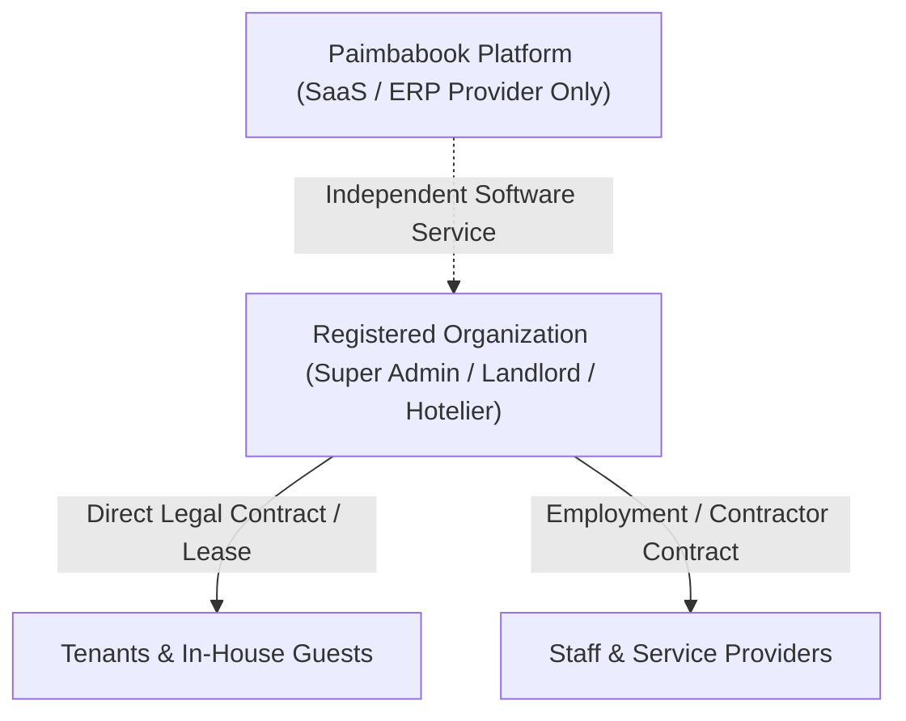
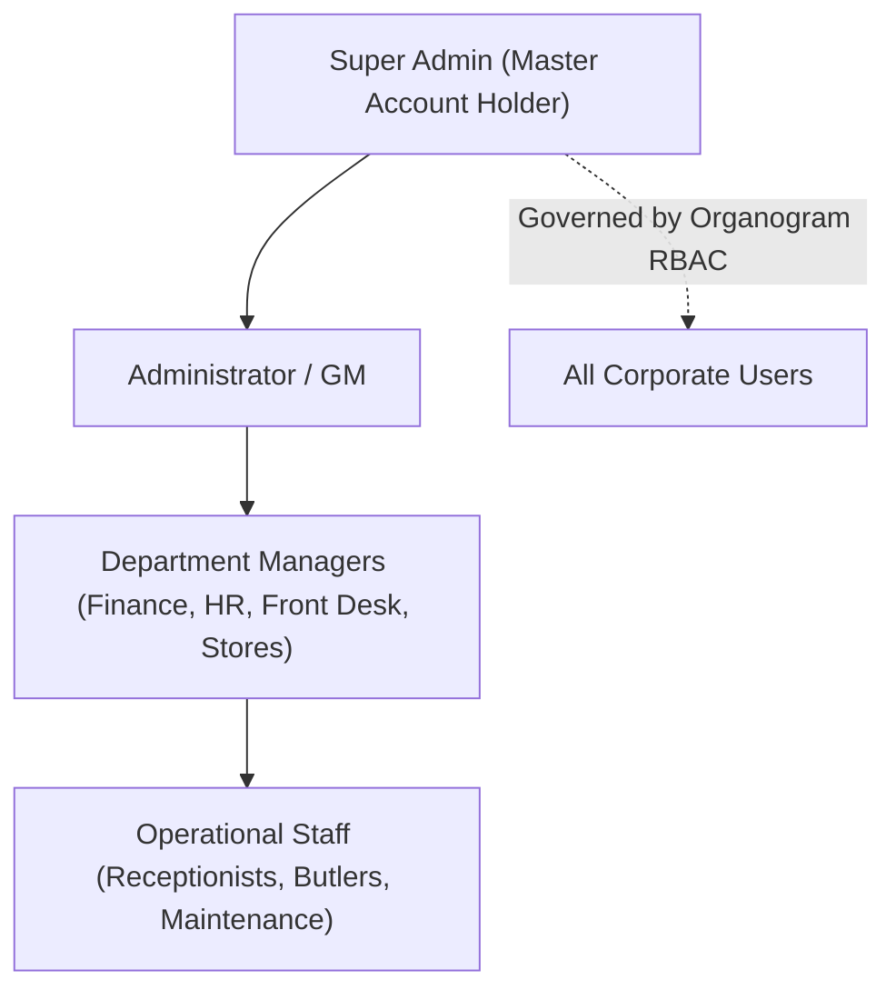
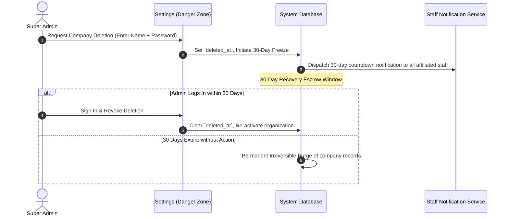

# Paimbabook Enterprise Platform: Master Terms & Conditions of Service
**Document Reference:** PB-TOC-2026-V2.4 | **Effective Date:** September 2026

---

## 1. Introduction & Acceptance of Terms

1.1 These Master Terms and Conditions ("Terms", "Agreement") constitute a legally binding agreement between **Paimbabook Platform Technologies** ("Paimbabook", "we", "us", or "our") and the corporate entity, landlord, hotelier, property manager, or individual user ("Client", "Organization", "Super Admin", or "User") accessing or utilizing the Paimbabook Enterprise Software-as-a-Service (SaaS) Platform, including all administrative dashboards, customer portals (`paimbabook.com`), mobile interfaces, and associated APIs.

1.2 By registering a company workspace, clicking "I Agree", signing in via Manager or Customer gateways, or utilizing any functionality within the platform, you expressly acknowledge that you have read, understood, and agree to be bound by all provisions of this Agreement. If you are entering into this Agreement on behalf of a company, trust, or other legal entity, you represent and warrant that you possess full legal authority to bind such entity to these Terms.

---

## 2. Platform Nature & Strict Non-Agency Disclaimer

2.1 **Technology Platform Only**: Paimbabook is exclusively an ERP and property management cloud software suite. Paimbabook is **not** an estate agency, property broker, auctioneer, legal adviser, financial institution, depository escrow agent, or hospitality operator. 

2.2 **No Principal-Agent Relationship**: Nothing in this Agreement or through the provision of platform features creates any agency, partnership, joint venture, employer-employee, or franchisor-franchisee relationship between Paimbabook and any Client, Super Admin, staff member, guest, or tenant.

2.3 **Independent Transactions**: All lease agreements, guest reservations, work orders, service provider contracts, and monetary exchanges negotiated, entered into, or tracked through Paimbabook are strictly between the Client and the respective third party (tenant, guest, contractor). Paimbabook is not a party to any lease, booking folio, or service agreement and disclaims all liability arising therefrom.

---

## 3. Statutory Compliance, Licensing & Regulatory Covenants

3.1 **Mandatory Statutory Licensing**:
- **Estate Agency & Property Practice**: Any Client managing residential or commercial real estate for third parties warrants that it holds a valid, current **Fidelity Fund Certificate (FFC)** issued by the **Property Practitioners Regulatory Authority (PPRA)** (or equivalent jurisdictional statutory licensing body such as the Estate Agency Affairs Board).
- **Hospitality & Lodging Operations**: Any Client operating boutique hotels, lodges, or short-term accommodations warrants full compliance with all municipal public health permits, liquor licensing boards, and local fire department life-safety certifications.

3.2 **Unlicensed Trading Prohibited**: The use of Paimbabook by any entity to operate an unlicensed property management or real estate brokerage business in violation of local laws is strictly prohibited. Clients assume sole, direct, and unmitigated civil and criminal liability for operating without statutory licenses.

3.3 **Indemnification**: The Client unconditionally agrees to defend, indemnify, and hold harmless Paimbabook, its officers, directors, employees, and technological infrastructure partners from and against any and all claims, regulatory fines, legal costs, damages, or government proceedings arising out of the Client’s failure to maintain valid statutory licenses or regulatory compliance.

---

## 4. User Roles, Governance & Operational Hierarchy

### 4.1 Role Classifications
1. **Super Admin**:
   - The primary organization owner and corporate billing guarantor.
   - Holds unrestricted authority over the organization’s tenancy, package subscription, banking setup, organogram hierarchy, and danger zone controls.
   - Sole authority capable of appointing successor Super Admins (requiring password verification) or initiating organization deletion.
2. **Administrator / General Manager**:
   - Delegated executive with broad supervisory access across departments, excluding master billing transfer and company-level destruction.
3. **Department Manager (Finance, Front Desk, HR, Procurement, Stores, Maintenance, Audit)**:
   - Authority bounded strictly by their department's functional remit and organogram clearance.
   - Empowered to approve requisitions, sign off on maintenance work orders, and review departmental audit trails.
4. **Operational Staff**:
   - Authorized operators (e.g., Receptionists, Housekeepers, Stores Receivers) restricted to specific action points such as check-ins, inventory intake, or work order status updates.
5. **Tenants & Public Guests**:
   - External users accessing the Front Portal (`paimbabook.com`) to search listings, review published leases, submit maintenance tickets, and track stay folios.

### 4.2 Credentials, 4-Digit Security PIN & Digital Signatures
- **Credential Integrity**: Users must maintain the absolute confidentiality of their login credentials. Sharing of user accounts across staff members is strictly prohibited.
- **4-Digit Security PIN**:
  - Destructive operations (including deletion of properties, rooms, units, contracts, and lease records) strictly require entering the user's **4-Digit Security PIN** (default `1234` upon initial account provisioning).
  - The entry of the correct 4-Digit PIN constitutes an authorized, audited digital sign-off equivalent to an explicit administrative instruction.
- **Digital Signatures**:
  - The platform permits Super Admins and authorized managers to upload an approved digital signature image (PNG/JPEG).
  - Stamping this digital signature onto system-generated Lease Agreements, Invoices, Purchase Orders, or Check-in Folios constitutes a legally binding representation by the Client that the underlying document was formally reviewed and executed by an authorized signatory.

---

## 5. Tenancy, Leasing & Financial Covenants

### 5.1 Standardized 11-Clause Dynamic Lease
The platform provides a dynamic lease drafting engine incorporating 11 standardized clauses governing property letting, escalation, deposit custody, defect reporting, sub-letting restrictions, and formal execution. The Client warrants that all custom values (rent amounts, deposit figures, tenant names) inserted into these clauses accurately reflect bona fide agreements.

### 5.2 10% Late Rent Interest Penalty
- Under Clause 4 of the Standard Lease Agreement and platform accounting rules, rent is payable strictly on or before the **1st calendar day of each month in advance**.
- In the event that rent remains unpaid after the 7-day grace period, the system calculates and applies a **statutory 10% late rent interest penalty** against the outstanding balance.
- Paimbabook provides the calculation engine as an administrative convenience; the Client retains ultimate legal responsibility for ensuring that interest rates applied comply with prevailing usury laws and national Credit Acts within their jurisdiction.

### 5.3 Proof of Payment (POP) & Discrepancy Audits
- Front desk check-ins with payment variances (underpayment or partial deposits) mandate entering an audited **Explanation / Discrepancy Reason**.
- Tenant rent records require verifiable Proof of Payment (POP) uploads.
- "Suppression" of a payment entry soft-voids the transaction to reopen tenant arrears while preserving the audit record. Purging suppression records is strictly disallowed to ensure financial compliance and forensic reconstructability.

---

## 6. Subscription Billing, 90-Day Free Trial & Quotas

### 6.1 Subscription Packages & Resource Quotas
Paimbabook provisions tiered operational packages:
- **Starter Package ($5/mo)**: Max 1 Property, 5 Rooms, 15 Tenants, 2 Staff.
- **Standard Package ($20/mo)**: Max 5 Properties, 25 Rooms, 60 Tenants, 6 Staff.
- **Professional Package ($50/mo)**: Max 20 Properties, 100 Rooms, 200 Tenants, 20 Staff.
- **Enterprise Conglomerate ($200/mo)**: Max 20 Properties, 500 Rooms, 600 Tenants, 100 Staff.
- **Bespoke Scale (Custom Quote)**: For portfolios requiring >20 Properties, >500 Rooms, >600 Tenants, and >100 Staff with custom ERP integrations.
- **Stripe Sandbox ($0.50/mo)**: Dedicated gateway verification tier for testing live card payments.

### 6.2 90-Day Free Trial & Card Upfront Covenants
1. New organizations are eligible for a **90-day upfront card-verified free trial**.
2. A valid credit or debit card must be registered upon trial enrollment. A nominal micro-verification charge (e.g. $0.50) may be executed to verify card legitimacy and immediately refunded or applied toward future service.
3. Unless cancelled by the Super Admin prior to the conclusion of the 90th day, the subscription automatically converts into the selected paid monthly package at the prevailing monthly rate.

### 6.3 Delinquency, Suspension & Read-Only Freeze
- In the event of recurring payment failure, a 3-day grace period is granted.
- If payment remains unsettled after 3 days, the organization workspace transitions to **Frozen Read-Only Mode**:
  - Staff may view existing data, print folios, and export reports.
  - Adding new properties, creating bookings, drafting leases, or publishing listings is blocked until the account is brought current.

---

## 7. Account & Company Deletion: 30-Day Soft-Deletion Freeze Policy

### 7.1 Personal User Account Deletion
- Initiated under **Settings &rarr; Danger Zone**.
- Requires typing `"delete"` and entering the user’s valid personal account password.
- Triggers an immediate **30-day soft-deletion freeze**:
  - The user's active session is terminated.
  - Logging in at any point within the 30-day window cancels the deletion request and re-activates the account.
  - Upon the expiration of 30 continuous calendar days without a login event, all personal identifiable information (PII) is permanently purged in compliance with GDPR and POPIA standards.

### 7.2 Organization / Company Deletion
- Restricted exclusively to the verified **Super Admin**.
- Requires typing the exact company name and entering the Super Admin’s master password.
- Initiates an organizational **30-day soft-deletion freeze**:
  - All company administrative functions and public portal listings are immediately suspended.
  - All affiliated staff accounts are placed in an operational hold.
  - An automated notification email is dispatched to every registered staff member notifying them of the 30-day countdown.
  - Logging in as Super Admin within the 30-day window offers an instant "Cancel Deletion & Restore Organization" recovery action.
  - If 30 days lapse without revocation, the organization data, properties, rooms, documents, and historical tables are permanently and irreversibly purged from platform production databases.
  - **Protection of Third-Party Consumer Accounts**: Independent customer/tenant profiles are preserved to allow historical access to their personal receipts and rental histories.

---

## 8. Intellectual Property & Listing Rights

8.1 **Platform IP**: Paimbabook owns all right, title, and interest in and to the platform, including software code, UI designs, logos, databases, algorithms, and documentation. No license is granted to reverse engineer, decompile, copy, or redistribute platform code.

8.2 **Client Content & Media**:
- Clients retain ownership of all property images, trademarks, logos, and descriptions uploaded to the platform.
- By publishing listings or banner advertisements to the Public Front Portal (`paimbabook.com`), the Client grants Paimbabook a non-exclusive, worldwide, royalty-free license to display, host, and index such media for the purpose of facilitating tenant searches, public bookings, and SEO discovery.
- The Client warrants that all photos uploaded (including the mandatory minimum of 2 photos for lodging rooms and 4 photos for residential agent listings) are original, unencumbered, and do not infringe on any third-party intellectual property or privacy rights.

---

## 9. Marketing, Banners & Listing Boosts

9.1 **Carousel Rotation & Ad Display**: Banner advertisements configured via the Marketing Hub are subject to platform placement constraints. A maximum of 4 featured advertisements may rotate simultaneously at 5-second intervals.

9.2 **Listing Boosts**: Purchasing search priority score boosts (+10, +20, +30) enhances visibility on `paimbabook.com` for the contracted duration. Boost fees are non-refundable once activated. Paimbabook does not guarantee specific lead volumes, rental conversions, or booking rates resulting from boosts.

---

## 10. Limitation of Liability & Warranties

10.1 **"As-Is" Service Provision**: The Paimbabook Platform is provided on an "AS IS" and "AS AVAILABLE" basis without warranties of any kind, whether express, implied, statutory, or otherwise, including implied warranties of merchantability, fitness for a particular purpose, or non-infringement.

10.2 **Exclusion of Consequential Damages**: In no event shall Paimbabook, its affiliates, licensors, or cloud providers be liable for any indirect, incidental, special, consequential, punitive, or exemplary damages, including but not limited to loss of rental income, guest cancellations, tenant default, loss of goodwill, data corruption, or hardware downtime, even if advised of the possibility of such damages.

10.3 **Aggregate Liability Cap**: To the maximum extent permitted by applicable law, Paimbabook’s total cumulative liability arising out of or related to this Agreement or the use of the platform shall not exceed the total fees paid by the Client to Paimbabook during the twelve (12) month period immediately preceding the event giving rise to liability.

---

## 11. Dispute Resolution, Governing Law & Severability

11.1 **Good Faith Negotiations**: In the event of any controversy, claim, or dispute arising out of or relating to this Agreement, the parties shall first endeavor to settle the dispute amicably through direct, good-faith executive consultations within thirty (30) days of written notice.

11.2 **Arbitration & Governing Law**: Any unresolved dispute shall be referred to and finally resolved by binding arbitration under the rules of the Arbitration Foundation of Southern Africa (AFSA) or equivalent jurisdictional body, administered in the jurisdiction in which Paimbabook’s corporate operating entity is registered.

11.3 **Severability**: If any provision of this Agreement is held to be invalid, illegal, or unenforceable by an arbitrator or court of competent jurisdiction, such provision shall be severed, and the remaining provisions shall continue in full force and effect.

---

## 12. Amendments & Regulatory Updates

Paimbabook reserves the right to amend or update these Master Terms and Conditions at any time. Material amendments will be communicated via top-bar dashboard notices, email dispatches, or modal popups upon login. Continued use of the platform following the effective date of an amendment constitutes unconditional acceptance of the revised Terms.

---
**Paimbabook Platform Technologies** &bull; Legal Compliance Department &bull; *Document End*
