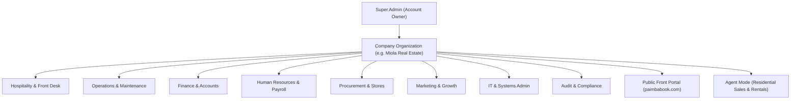
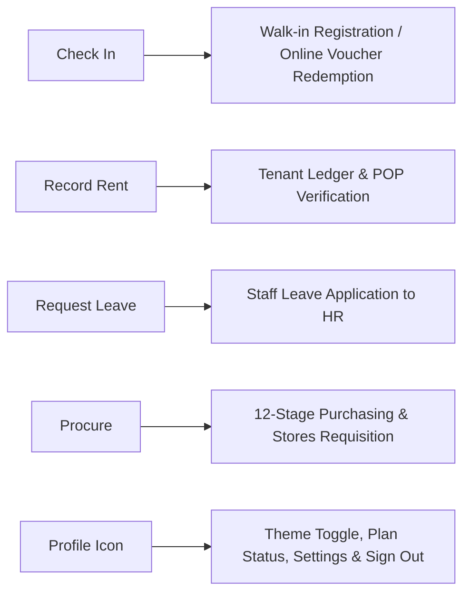
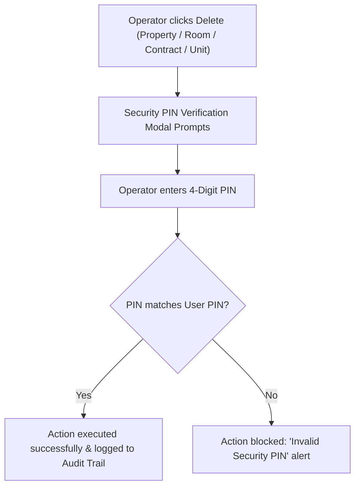
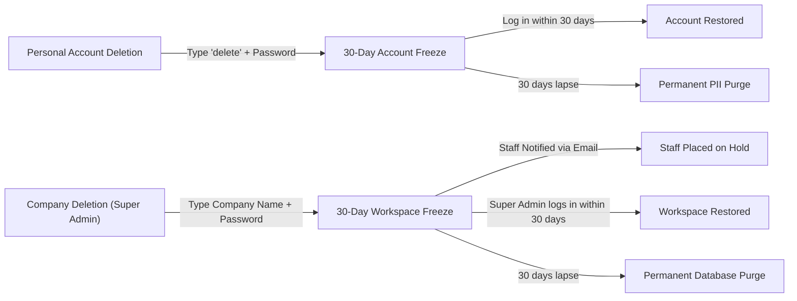

# Paimbabook Enterprise Platform: Complete User & Operations Manual
**Version:** 2.4 | **Applicable For:** Multi-Tenant Organizations, Super Admins, Department Managers, and Operational Staff

---

## 1. System Overview & Architecture

### 1.1 The "WordPress of Real Estate & Hospitality"
Paimbabook operates on a true multi-tenant organizational structure. Just as WordPress allows anyone to spin up an independent site with custom themes, plugins, and users, Paimbabook allows any property enterprise or hospitality owner to register an independent organization, become the **Super Admin**, brand their workspace, and provision departmental staff under strict Role-Based Access Control (RBAC).



### 1.2 Two Distinct Access Gateways
The platform separates customer/guest traffic from authorized corporate operations:
1. **Public Front Portal (`paimbabook.com`)**:
   - For prospective tenants, lodge guests, and property buyers.
   - Allows search by Category (*All Listings, Book a Room, For Rent, For Sale*), Country, and City.
   - Customers log in via **Sign In** (top right) to view booking history, leases, tickets, and receipts.
2. **Manager / Corporate Login (`/login` or `/c/:companySlug/login`)**:
   - Restricted to authenticated company personnel (Super Admins, Department Managers, Staff).
   - Grants access strictly to authorized departments and features based on the organization's **Organogram & Permissions Matrix**.

---

## 2. Top-Bar Rapid Action Suite

Accessible on all administrative screens, the top action bar provides one-click operational workflows:



### 2.1 "Check In" (Front Desk Instant Guest Center)
- **Instant Walk-In Registration**:
  - Automatically generates an immutable **System Audit Booking Code** (e.g., `BK-VZ4W-K2HSQ8`).
  - Selection of Commercial Property / Lodge and vacant Room / Unit.
  - Automatic capacity checks (Adults, Children).
  - Guest demographic inputs: Full Name, Phone, Email, Passport / ID Number.
  - Check-in & Check-out date pickers with live nights calculation.
- **4-Tier Meal & Board Package Selector**:
  - **Room Only (Bed Alone)**: Room accommodation without food.
  - **Bed & Breakfast (B&B)**: Accommodation plus morning breakfast.
  - **Bed, Breakfast & Lunch (Half Board+)**: Mid-day catering included.
  - **Full Board**: Breakfast, Lunch, and Evening Dinner included.
- **Payment Reconciliation & Discrepancy Note**:
  - Payment method options: *Card Terminal, Cash at Front Desk, Bank Transfer / EFT, Online Prepayment, Corporate Account*.
  - When the collected amount does not match the total payable rate (e.g., underpayment or deposit), an **Explanation / Reason for Difference** is strictly required by the audit engine before key issuance.

### 2.2 "Record Rent Payment" (Tenant Collections & POP Audit)
- **Live Portfolio Health Metric**: Displays collection percentage, fully settled units, arrears count, and unassigned tenants.
- **Strict Property Assignment Gate**: Tenants without an assigned property cannot have rent recorded against them until assigned to a lease.
- **Duplicate & Overpayment Prevention**:
  - If a tenant has already settled their full monthly rent, regular rent entry is blocked to prevent accidental double-recording.
  - To record future payments, staff must check **Advance Payment** and specify the future billing month.
- **Audit Suppression & Restoration**:
  - Erroneous or void entries can be **Suppressed** (soft-voided). This reopens the tenant's balance while preserving the historical record for audit compliance.
  - Suppressed entries can be **Restored** by authorized audit managers.
- **Proof of Payment (POP) Documents**:
  - Upload PDF or image receipts for every transaction.
  - Replace or audit uploaded POP files with recorded timestamps and staff identity tags.

### 2.3 "Request Leave"
- Accessible to all company staff members.
- Leave categories: *Annual, Sick, Study, Maternity, Paternity, Bereavement, Unpaid*.
- Start Date and End Date range calculation.
- Optional medical certificate or supporting document attachment (PDF/Image).
- Routes directly into the **Human Resources & Payroll** approvals queue.

### 2.4 "Procure" (Personal & Departmental Requisitions)
- Three operational tabs: **Request Procurement**, **View Requests**, and **Approvals**.
- 11 Target categories: *Tools & Hardware, Cleaning & Sanitization, Electrical & Plumbing, Hospitality Linens, Office Supplies, IT & Electronics, Furniture & Fixtures, Kitchen & F&B, Safety & Medical, Maintenance Materials, Other*.
- Urgency tiers: *Standard (Routine), High Priority (Operational impact), Emergency (Guest disruption/Safety hazard)*.
- Three approval routing channels:
  1. *Department Senior / Direct Supervisor*
  2. *Super Admin / General Manager*
  3. *Self-Approval (Emergency bypass)*

---

## 3. Departmental Operations Guide

### 3.1 Hospitality & Core

#### A. Executive Dashboard
- **Operational Command Desk**: Visual cards showing active status across Front Desk, Maintenance, Stores, Accounts, and HR.
- **Occupancy & Collection Gauges**: Real-time room occupancy percentage and current month rental collection rate.
- **Property Check-In & Guest Roster**: Expandable list of commercial lodges and apartments showing live guest folios, dates, meal packages, and clerk notes.
- **Pending Actions & Due Items Hub**: Centralized backlog tracking open work orders, overdue checkouts, and pending procurement authorizations.

#### B. System Statistics & Analytics
- Multi-window filtering: *Today, This Week, This Month, This Quarter, Year-to-Date, All Time*.
- Metrics: *Total Revenue, Net Operating Margin, Portfolio Occupancy, Active Leases & Bookings, Inventory Valuation, Open Tasks, and Staff Headcount*.
- Graphical trajectories: Financial Trajectory (*Revenue vs Expenses vs Margin*), Revenue by Stream (*Bookings vs Leases vs Services*), Departmental Budget Consumption, and Maintenance Breakdown.

#### C. Front Desk & Hospitality Bookings
- **Status Filter**: *All Bookings, Checked In, Stay Extended, Confirmed / Upcoming, Checked Out*.
- **Bookings & Front Desk Report**: Generates customizable analytical reports with PDF export, print layout, and email dispatch across custom date ranges.
- **Express Checkout & Overstay Desk**: Live stay timers flagging guests approaching departure or exceeding checkout time for rapid departure processing.
- **Guest Checkout History**: Complete audit archive with stay lengths, total folio revenue, payment methods, and historical folios.

#### D. Rooms & Commercial Lodging Sub-Management
- **Property Pre-Condition**: Rooms cannot exist in a vacuum; every room must belong to a registered accommodation property.
- **Room Configuration**:
  - Room number/name, category (*Standard, Single, Double, Twin, Luxury Suite, Deluxe, Family Chalet, Penthouse, Executive*), floor level, and adult/child capacity.
  - Nightly 4-tier meal pricing (Bed Only, B&B, Half Board+, Full Board).
  - Booking channel: *Paimbabook Native Engine* vs. *Custom External Link / Affiliate Redirect*.
  - Mandatory room photography (minimum 1 high-resolution photo required before saving).
- **Uniform & Board Pricing**: Apply uniform flat rates across all rooms of a property in a single operation.
- **Housekeeping Queue**:
  - Supports individual room cleaning or entire floor corridors/wings.
  - Custom shifts with defined supervisors and cleaner rosters.
  - Target cleaning duration timers that turn red when turnover time is exceeded.
  - Before/after cleaning photo verification.
- **Room Service Orders**: Dispatch breakfast, lunch, dinner, bar trays, laundry, or luggage assistance to rooms with runner assignments and countdown timers.

#### E. Properties & Lodges
- Supports diverse property types: *Hotels, Safari Lodges, Motels, Guest Houses, Commercial Complexes, Residential Houses, Apartments, and Storage Units*.
- Multi-country and city geo-tagging.
- Promotional discount sliders (0% to 100%) with start and end dates.
- Option to cascade discounts and booking channels across all child rooms.

#### F. Tenants & Leases
- Directory of all long-term residents and commercial tenants.
- Tracking of tenure status (*Active, Notice, Ended*), contact details, assigned units, and payment health.
- Direct linking between tenant profiles, rental contracts, and monthly billing cycles.

---

### 3.2 Operations & Maintenance

#### A. Maintenance Hub & Work Orders
- Ticket creation categorized by trade: *Plumbing, Electrical, Structural, Appliance, HVAC, Pest Control, Painting, Landscaping, General*.
- Priority classification: *Low, Medium, High, Urgent*.
- Contractor and internal staff assignment with estimated vs. actual cost auditing.

#### B. Service Providers Directory
- Centralized register of external vetted contractors, artisans, and maintenance companies.
- Fields: Contact numbers with international country codes, trade specializations, standard hourly/job rates, deployment history, and cumulative payout tracking.

#### C. Property Inspections
- Protocols for: *Move-In, Move-Out, Routine Checkup, Annual Inspection, Emergency Audit*.
- Target scope by Property, Tenant, or specific Room.
- Assigned staff inspector tracking and scheduled date timelines.

#### D. Scheduled Preventive Tasks
- Recurring maintenance protocols configured by frequency (*One-time, Daily, Weekly, Bi-weekly, Monthly, Quarterly, Semi-annually, Annually*).
- Next due date automation, assigned service partner, and cycle valuation budgeting.

#### E. Maintenance Inventory & Stock
- Real-time stock tracking for maintenance hardware, electrical components, plumbing spares, and consumables.
- Direct real-time bidirectional synchronization with the **Stores & Inventory** module (`/stores`).

---

### 3.3 Finance & Accounts

#### A. Rent & Revenue
- Comprehensive rent roll tracking collections across all leased properties.
- Digital receipt issuance and arrears tracking.

#### B. Invoices & Billing
- Automated and manual tenant invoice generation.
- Commercial billing schedules with payment status (*Paid, Partially Paid, Overdue, Cancelled*).

#### C. Bills & Schedules
- Tracking recurring municipal utility commitments, property rates, electricity, water, and vendor subscriptions.
- Scheduled outflow reminders with proof of payment attachment.

#### D. Financial Accounts & Daily Journal
- General ledger tracking income, operating expenses, asset transfers, and owner distributions.
- Multi-tier payment approval workflow: staff enter transactions &rarr; submit for approval &rarr; manager/CFO digital authorization.

#### E. Financial Reports & Balance Sheets
- Real-time Balance Sheets, Cash Flow statements, and Net Operating Income (NOI) reports.
- Exportable to PDF and printable for executive audit.

---

### 3.4 Human Resources & Payroll

#### A. Employee Directory & Staff Profiles
- Centralized staff directory tracking employment status, department, role level, and job grades.
- Digital signature uploads for contracts and payment authorizations.

#### B. Staff Contracts & Lifecycle
- Fixed-term and permanent employment contracts with automated expiration countdowns.
- Renewal and termination protocols.

#### C. Payroll & Compensation
- Automated mass payroll calculation incorporating base salaries, allowances, overtime, tax deductions, and net payouts.
- Digital payslip generation and distribution.

#### D. Leave Management
- Centralized approval desk for staff leave requests submitted via the top action bar.
- Leave balance deductions and departmental shift coverage tracking.

---

### 3.5 Procurement & Stores

#### A. 12-Stage Purchasing Engine
From initial requisition to warehouse delivery:
```text
1. Draft Requisition ──► 2. Supervisor Approval ──► 3. RFQ Generation ──► 4. Supplier Bidding
                                                                               │
8. Stores Delivery  ◄── 7. Purchase Order   ◄── 6. Fund Disbursement ◄── 5. Quote Evaluation
        │
9. Quality Inspection ──► 10. Stores Cataloging ──► 11. Department Release ──► 12. Final Audit
```

#### B. Quotation Gathering & RFQ Management
- Upload and compare up to 10 supplier quotations per requisition.
- Generate and email formal Request for Quotation (RFQ) documents directly to vendors.
- Procurement Manager signoff with automatic escalation to Finance for fund release.

#### C. Stores Central Warehouse & Sub-Stores
- Stock cataloging, physical count auditing, and minimum reorder threshold alerts.
- Material issuance with digital recipient acknowledgments.

---

### 3.6 Customer Portal & Agent Mode

#### A. Room Showcase
- Public-facing showcases for lodging and commercial rooms.
- Requires high-resolution photography (minimum 2 photos), room descriptions, amenity checklists, and nightly meal plan pricing.

#### B. Enquiries & CRM Ticket Desk
- Unified inbox capturing prospective customer questions from `paimbabook.com`.
- **24-Hour Auto-Close Policy**: Tickets without staff response for 24 hours are automatically closed to keep the queue fresh.
- Rapid response templates: *Schedule a Viewing, Lease Terms & Deposit, Utilities & Wi-Fi, Check-In Policies, Parking & Pets, Furnishing*.

#### C. Agent Mode (Residential Listings)
- Dedicated workspace for real estate agents and residential rental managers.
- Workflow: Residential properties are imported from the company portfolio or created as custom listings &rarr; configured with agent contact details &rarr; published to the public front portal index.
- Minimum 4 photos strictly required for public publishing.
- Agent profile badges attached to published listings with direct WhatsApp and phone links.

---

### 3.7 Marketing & Growth

#### A. Front Portal Banner Ads
- Manage promotions and announcement banners on `paimbabook.com`.
- Placements:
  - **Hero Visual Carousel Banner**: Top banner of the homepage.
  - **Top Announcement Ticker**: High-visibility ticker banner across listings.
  - **Native In-Feed Sponsored Card**: Cards blended natively between search results.
- Automatic 5-second alternating rotation for top results (max 4 displayed simultaneously).
- Impression and click conversion analytics (CTR tracking).

#### B. Listing Boosting
- Prioritize showcased rooms and residential listings on search results.
- Boost Tiers:
  - **Standard**: +10 priority ranking score.
  - **Featured**: +20 priority ranking score with visual badge.
  - **Premium Sponsor**: +30 priority ranking score with golden highlight borders.
- Daily budget controls with secure payment gateway integration.
- Full transaction recording in `payment_transactions` for auditing.

---

### 3.8 IT, Administration & Compliance

#### A. Users & Rights (RBAC)
- Provision staff accounts across 10 functional departments:
  - *Administration, Front Desk, Maintenance, Accountant/Finance, Human Resources, IT, Procurement, Stores, Audit, Operations Management*.
- Role clearance levels: *Super Admin, Admin, Manager, All Rights, Staff*.
- Granular permission matrix with over 50 toggleable system rights.
- Security actions: Reset Password, Reset PIN, Deactivate Account, Appoint Super Admin.

#### B. Organogram & Governance Hierarchy
- Visual tree illustrating supervisory reporting lines from Super Admin down to operational staff.
- Custom role creation: define title, department, clearance, "Reports To" senior, allowed duties, and restricted boundaries.
- Strict enforcement: staff can only execute functions explicitly permitted by their assigned organogram position.

#### C. Dynamic Lease Contracts Engine
- **Pre-Condition**: Landlord details (*Full Name, ID/Passport, Address, Banking Details*) must be configured before contracts can be drafted.
- **11 Standardized Legal Clauses**:
  1. *Memorandum of Agreement*
  2. *Property Letting Identification*
  3. *Lease Period & Rent Escalation*
  4. *Rent Payment Schedule & 10% Late Interest Penalty*
  5. *Security Deposit Structure & Allowable Deductions*
  6. *Property Maintenance & 7-Day Defect Reporting*
  7. *Alterations, Painting, and Fire Hazard Restrictions*
  8. *Condition at Handover & Utility Usage Guidelines*
  9. *Sub-Letting Prohibition & Nuisance Rules*
  10. *Notice Period & Early Termination Penalties*
  11. *Formal Execution & Witness Signatures*
- Full document export options: Generate PDF, Print, Download, Email, WhatsApp Share, Suppress, and Terminate.

#### D. Forensic Audit Trail & Visual User Journey
- **Immutable Activity Trail**: High-precision logging of every critical system event (*Timestamp, Action, Target Entity, Performed By, Technical Details*).
- **Check-In & Checkout Patterns**: Visual trends analyzing average length of stay, peak arrival hours (14:00–16:00), meal plan breakdowns, and room turnover efficiency.
- **Financial Audit Reconciliation**: Verified audit stream comparing invoices, rent payments, and bank references for tax compliance.
- **Visual Click Map & Flow Pathways**: Tracks origin &rarr; destination screen transitions (e.g. `/room-management` &rarr; `/commercial-bookings`) to monitor operator efficiency and detect UI bottlenecks.
- **Paginated Display**: User-controlled rows (10, 50, 100) with vertical scrolling containers to prevent infinite screen overflow.

---

## 4. Security & Deletion Freeze Policies

### 4.1 Account & Company Deletion (30-Day Freeze)
- **Personal Account Deletion**:
  - Requires typing `"delete"` **plus entering account password** to confirm.
  - Soft-deletes user metadata and initiates a 30-day freeze.
  - Logging in anytime during the 30 days automatically restores the account.
  - After 30 days, personal data is permanently purged.
- **Company Deletion (Super Admin Only)**:
  - Requires typing the exact company name **plus entering Super Admin password**.
  - Initiates a 30-day company freeze.
  - Freezes all affiliated staff accounts and notifies them via email with countdown and registration links.
  - Preserves third-party customer accounts (tenants/guests remain unaffected).

### 4.2 Newly Added Staff Password Setup Gate
- `/set-password` is strictly locked to newly added staff members whose records exist in `company_users` with `password_initialized: false`.
- Arbitrary/random emails are blocked with an immediate security alert.
- Existing accounts attempting to use `/set-password` are directed to `/auth/reset-password`.

---

## 5. Settings, Security & System Administration

Accessible exclusively to authorized administrative personnel via the top-bar profile menu, the **Settings & Security** module controls corporate branding, operational thresholds, financial defaults, security safeguards, and multi-tier subscription quotas.

### 5.1 Subscription & Billing Packages

Paimbabook provides five production tiers and a dedicated gateway sandbox. Each tier enforces strict database-level quotas on properties, rooms, tenants, and staff accounts:

| Package Tier | Monthly Rate | Max Properties | Max Rooms | Max Tenants | Max Staff Accounts | Key Included Modules |
| :--- | :--- | :--- | :--- | :--- | :--- | :--- |
| **Starter Package** | $5 / month | 1 Property | 5 Rooms | 15 Tenants | 2 Staff | Rent collection, automated invoices, basic maintenance (up to 5 work orders), guest check-in. |
| **Standard Package** | $20 / month | 5 Properties | 25 Rooms | 60 Tenants | 6 Staff | Express checkout desk, stay countdown timers, 4-tier meal pricing (BB, HB, FB, Room Only), maintenance hub. |
| **Professional Package** | $50 / month | 20 Properties | 100 Rooms | 200 Tenants | 20 Staff | Full 12-stage procurement pipeline (Requisitions, RFQs, POs), HR suite (leave tracking & contracts), agent portal. |
| **Enterprise Conglomerate** | $200 / month | 20 Properties | 500 Rooms | 600 Tenants | 100 Staff | Visual user journey map, deep session click forensics, advanced financial journal reconciliation, full organogram. |
| **Bespoke Scale** | Custom Quote | > 20 Properties | > 500 Rooms | > 600 Tenants | > 100 Staff | Infinite tenancy archiving, custom ERP integrations (SAP, Oracle, QuickBooks), dedicated SLA and engineering support. |
| **Gateway Sandbox** | $0.50 / month | 1 Property | 5 Rooms | 15 Tenants | 2 Staff | Live payment card verification, webhook testing, and integration validation. |

#### A. 90-Day Free Trial & Card Verification
- Newly registered organizations qualify for a **90-day free trial**.
- Enrollment requires entering valid card details upfront for identity verification (a refundable or creditable $0.50 micro-charge may be executed).
- Organizations can switch tiers at any time.
- If not cancelled prior to the 90th day, the plan auto-renews at the standard monthly fee of the active package tier.
- If payment fails following the expiration of the trial or subscription cycle, a 3-day grace period is granted, after which the organization is placed in **Frozen Read-Only Mode**.

#### B. Bespoke Enterprise Sales Inquiry Modal
- Clicking **Contact Our Sales Agent** on the Bespoke Scale package opens a custom intake modal.
- Captures: *Full Name, Business Email, Contact Phone, Subject, Detailed Requirements*, and optional slider estimates for *Number of Properties, Total Rooms, Estimated Tenants, and Staff Size*.
- Inquiries are logged to the database table `sales_package_enquiries` and dispatched to the platform operations desk.
- Super Admins can view incoming bespoke inquiries directly within the Control Admin dashboard.

---

### 5.2 4-Digit Security PIN & Authorization Gate

To protect against inadvertent data loss or malicious actions by unauthorized personnel, the platform enforces a secondary authentication barrier:



- **Default PIN**: Every newly provisioned staff account is assigned a default PIN of `1234`.
- **PIN Management**: Users can update their security PIN under **Settings &rarr; Security Credentials**.
- **Admin PIN Reset**: If a staff member forgets their PIN, a Super Admin or authorized manager can reset the PIN back to `1234` via the Users Management table row action.
- **Enforced Operations**:
  - Deleting a Property or Lodge.
  - Deleting an Accommodation Room.
  - Deleting a Lease Contract or suppressing legal documents.
  - Purging an inventory SKU or asset record.

---

### 5.3 Corporate Digital Signatures & Branding

- **Signature Stamp Upload**:
  - Super Admins can upload a corporate stamp or authorized digital signature (PNG or JPEG with transparent background recommended).
  - The signature file is securely stored in object storage and associated with the organization profile.
- **Automated Document Stamping**:
  - Automatically rendered on system-generated **Dynamic Lease Agreements** in the Landlord Execution block.
  - Rendered on **Rent Invoices & Receipts** generated for tenants.
  - Stamped on **Procurement Purchase Orders (POs)** authorized by department managers.
  - Displayed on **Guest Checkout Folios** upon departure.

---

### 5.4 Organization Identity & Financial Parameters

- **Organization Profile**:
  - **Company Name**: Editable branding name displayed across all headers, guest vouchers, and invoices.
  - **Custom URL Slug**: Unique organizational identifier (e.g. `miola-real-estate`) used for direct employee logins (`/c/miola-real-estate/login`).
  - **Contact Information**: Official business telephone number, corporate email address, and physical headquarters location.
  - **Registration Details**: Corporate registration number and tax identification (e.g., VAT number).
- **Financial Defaults**:
  - **Operational Currency**: Base currency symbol (e.g. ZAR `R`, USD `$`, EUR `€`, GBP `£`).
  - **Standard VAT / Sales Tax Rate**: Configurable percentage applied automatically to generated rent bills, maintenance invoices, and room rates.
  - **Bank Account Details**: Landlord/Company banking coordinates (Bank Name, Account Holder, Account Number, Branch Code, SWIFT Code) printed directly onto tenant payment instructions and invoice footers.

---

### 5.5 Danger Zone & Deletion Freeze Safeguards

Positioned at the base of the Settings page, the Danger Zone manages high-risk account lifecycle events:



1. **Delete Personal Account**:
   - Available to any staff member.
   - Requires confirming by typing the exact keyword `"delete"` and supplying the account’s valid password.
   - Enforces a 30-day soft-deletion freeze. Logging in anytime within 30 days immediately cancels the deletion and restores normal access.
2. **Delete Organization / Company (Super Admin Only)**:
   - Exclusively visible to the primary Super Admin.
   - Requires typing the exact company name and verifying the Super Admin’s master password.
   - Initiates an organization-wide 30-day freeze:
     - Disables public listings and portal visibility.
     - Places all affiliated employee accounts on temporary administrative hold.
     - Automatically dispatches alert emails to all registered staff with a countdown notice.
     - Preserves guest and tenant records so customers retain access to historical payment receipts.

---

### 5.6 Top-Bar Profile Menu

To streamline the user experience, organizational settings and user controls are centralized in the top-bar profile menu (represented by the user avatar/profile icon on the upper-right corner of every administrative screen):

- **User Identity**: Displays the logged-in user’s full name, role badge (e.g., *Super Admin*, *Finance Manager*), and verified email address.
- **Theme Switcher**: One-click toggle between **Dark Mode** and **Light Mode** across the entire UI.
- **Active Subscription Status**: Displays the current package tier (e.g. *Starter Package ($5)*, *Enterprise ($200)*) and renewal status.
- **Settings Shortcut**: Direct link to the `/settings` suite for quick access to billing, credentials, and company parameters.
- **Sign Out**: Securely clears the Supabase authentication session and redirects to the appropriate login portal.

---

## 6. Table Row Actions & Icon Reference Guide

Paimbabook utilizes a standardized set of row action icons across all data grids. Below is the operational specification for every icon across key modules.

### 6.1 Properties & Lodges Table (`/properties`)

| Icon | Action Name | Tooltip / Description | Operational Behavior & Modal Flow |
| :---: | :--- | :--- | :--- |
| `Eye` | **Inspect Details** | View property summary | Opens a comprehensive property modal showing address, total units, current occupancy rate, and assigned manager. |
| `KeyRound` | **Instant Check-In** | Rapid guest check-in | *Visible on Hospitality properties only.* Opens the Check-In modal pre-populated with this property and filters available rooms. |
| `TrendingUp` | **Stats & Financials** | View property analytics | Opens a visual performance modal displaying revenue trends, occupancy percentages, and maintenance expense breakdowns. |
| `Globe` / `EyeOff` | **Toggle Portal Publishing** | Publish / Unpublish listing | *Visible on Rental properties only.* Toggles visibility of the property on `paimbabook.com`. (Requires minimum photos). |
| `Pencil` | **Edit Property** | Modify property information | Opens the property configuration drawer to update name, address, unit counts, default amenities, or contact details. |
| `Trash` | **Delete Property** | Remove property from portfolio | Triggers the **4-Digit Security PIN Modal**. Upon entering the correct PIN, checks for active leases/occupied rooms before deletion. |
| `ChevronRight` | **Deep Inspect** | Open property detail view | Navigates directly to `/properties/:id` to inspect individual room rosters, tenant assignments, and dedicated logs. |

---

### 6.2 Users & Rights Management Table (`/users-management`)

| Icon | Action Name | Tooltip / Description | Operational Behavior & Modal Flow |
| :---: | :--- | :--- | :--- |
| `Activity` | **User Journey & Activity** | View live session & click map | Opens a forensic profile modal displaying the user's active session status, last login IP/timestamp, and button click pathway. |
| `Crown` | **Appoint Super Admin** | Promote user to Super Admin | *Super Admin only.* Promotes an Admin to co-Super Admin. Requires current Super Admin to verify their master account password. |
| `ShieldCheck` | **Manage Rights** | Edit granular permissions matrix | Opens the permissions drawer containing 50+ granular rights checkboxes categorized across all 8 functional departments. |
| `KeyRound` | **Reset PIN** | Reset 4-digit security PIN | Resets the employee's authorization PIN back to default `1234`. Dispatches confirmation notice to the user. |
| `Mail` | **Send Password Reset** | Dispatch password recovery link | Automatically triggers Supabase auth recovery email to the employee's registered inbox so they can reset forgotten credentials. |
| `Trash2` | **Deactivate / Delete** | Terminate company user access | Revokes company permissions, removes the user from the organogram, and terminates active access tokens. |

---

### 6.3 Accommodation Rooms & Pricing Directory (`/room-management`)

| Icon | Action Name | Tooltip / Description | Operational Behavior & Modal Flow |
| :---: | :--- | :--- | :--- |
| `Pencil` | **Edit Room** | Update room configuration | Opens the room editor to modify room number, category, base rates, 4-tier meal pricing, amenities, and uploaded photos. |
| `Link` | **Copy Booking Link** | Copy direct booking URL | Copies a direct booking link (`paimbabook.com/book/:propertyId/:roomId`) to the clipboard for sharing with prospective guests. |
| `Trash` | **Delete Room** | Remove room from inventory | Prompts for the user's **4-Digit Security PIN**. Blocks deletion if the room currently has an active guest or upcoming reservation. |

---

### 6.4 Dynamic Lease Agreements & Contracts (`/contracts`)

| Icon | Action Name | Tooltip / Description | Operational Behavior & Modal Flow |
| :---: | :--- | :--- | :--- |
| `FileText` | **Generate Document** | Compile 11-clause agreement | Compiles tenant data, landlord profile, property details, and financial covenants into the standardized legal blueprint. |
| `Eye` | **View Agreement** | Preview agreement text | Opens a formatted full-screen preview modal displaying all 11 legal clauses, penalty terms, and execution signature blocks. |
| `Download` | **Download PDF** | Export agreement as PDF | Renders and downloads a print-ready PDF containing the corporate letterhead, dynamic clauses, and digital signature stamp. |
| `Printer` | **Print Contract** | Send to physical printer | Launches browser print dialog pre-formatted for A4/Letter paper with optimized page breaks and header suppression. |
| `Mail` | **Email Agreement** | Dispatch agreement via email | Sends a branded email with the attached PDF agreement directly to the tenant's registered email address. |
| `MessageCircle` | **WhatsApp Direct Share** | Share via WhatsApp | Generates a pre-filled WhatsApp link with the tenant's number and a secure document download link for mobile review. |
| `ShieldAlert` | **Suppress Agreement** | Soft-void contract for disputes | Marks the agreement as "Suppressed". Halts rent accrual while preserving the entire legal trail for court or audit inspection. |
| `RefreshCw` | **Restore Agreement** | Re-activate suppressed lease | Reinstates a previously suppressed agreement back into active status. Records operator identity in the audit trail. |
| `Trash` | **Delete Contract** | Permanently remove record | Triggers the **4-Digit Security PIN Modal**. Permitted only for draft or voided contracts with zero outstanding financial ledgers. |

---

### 6.5 Tenants & Leases Table (`/tenants-leases`)

| Icon | Action Name | Tooltip / Description | Operational Behavior & Modal Flow |
| :---: | :--- | :--- | :--- |
| `FileText` | **Tenancy Ledger** | View payment ledger & balance | Opens the tenant's historical billing record, showing all invoices, recorded rent payments, POP receipts, and current arrears. |
| `Pencil` | **Edit Tenant** | Update tenant demographics | Modifies tenant full name, ID/Passport number, contact phone, employer details, and assigned unit. |
| `Mail` | **Send Statement** | Email monthly statement | Dispatches a breakdown of rent due, utilities, late penalties, and payment instructions to the tenant’s inbox. |
| `DollarSign` | **Record Payment** | Instant rent collection | Opens the rent recording modal pre-populated with the tenant's assigned property, monthly rate, and current balance. |
| `Trash` | **Terminate / Inactive** | End tenancy or archive record | Marks the tenant record as "Inactive" and frees up the assigned room/unit for immediate re-letting. |

---

### 6.6 Invoices & Billing Table (`/invoices`)

| Icon | Action Name | Tooltip / Description | Operational Behavior & Modal Flow |
| :---: | :--- | :--- | :--- |
| `Eye` | **View Invoice** | View invoice folio | Displays line items, tax breakdowns, discount deductions, payment instructions, and corporate digital signature. |
| `Printer` | **Print / Download** | Export invoice to PDF/Paper | Opens formatted print preview optimized for standard accounting stationery. |
| `CheckCircle` | **Mark as Paid** | Settle invoice balance | Manually reconciles an invoice when payment has cleared bank accounts without automated gateway capture. |
| `Mail` | **Send Invoice** | Dispatch invoice via email | Automatically transmits an invoice notification and download link to the tenant or corporate customer. |
| `ShieldAlert` | **Void / Suppress** | Invalidate erroneous invoice | Marks invoice as "Void", removing the revenue accrual from financial ledgers while maintaining audit compliance. |

---

### 6.7 Maintenance Work Orders Table (`/maintenance`)

| Icon | Action Name | Tooltip / Description | Operational Behavior & Modal Flow |
| :---: | :--- | :--- | :--- |
| `Eye` | **Inspect Work Order** | View full defect report | Shows defect description, initial photos, reported timestamp, priority badge, and assigned contractor details. |
| `UserPlus` | **Assign Provider** | Dispatch external service provider | Assigns a verified plumber, electrician, or artisan from the Service Providers directory with estimated completion dates. |
| `Clock` | **Update Progress** | Advance workflow state | Transitions work order status (*Open &rarr; In Progress &rarr; Awaiting Parts &rarr; Completed &rarr; Inspected*). |
| `DollarSign` | **Cost Reconciliation** | Enter actual repair costs | Logs contractor invoice total against initial estimate, recording variance in departmental maintenance expenses. |
| `Printer` | **Print Job Card** | Generate physical work order | Prints a standardized job card for contractor on-site sign-off upon completion of physical repairs. |

---

## 7. Operational Best Practices & Troubleshooting

### 7.1 Best Practices for Super Admins
1. **Maintain Strict Organogram Reporting**: Ensure all newly invited staff are placed under their respective department heads with minimal clearance required for their daily tasks.
2. **Mandatory 4-Digit PIN Security**: Remind staff never to share their security PIN. Review the audit trail periodically for repeated invalid PIN attempts.
3. **Keep Landlord Profile Up to Date**: Complete the Landlord Details drawer in Settings before generating lease contracts to ensure all 11 legal clauses populate with correct legal entities.
4. **Regular Trial & Billing Review**: Monitor subscription quota metrics under Settings to avoid hitting room or tenant limits during peak operational cycles.

### 7.2 Common Troubleshooting Scenarios
- **"All rooms must belong to an accommodation property"**:
  - *Cause*: Attempting to create a room before creating a hospitality property.
  - *Resolution*: Navigate to `/properties`, create a property with type set to **Commercial / Accommodation / Lodging**, and then add rooms under that property.
- **"Monthly Rent is Fully Paid - Recording Additional Rent Prohibited"**:
  - *Cause*: Staff attempting to record a second regular payment for the same calendar month.
  - *Resolution*: If the tenant is paying for the subsequent month, check the **Advance Payment** toggle and select the next calendar month.
- **"Invalid Security PIN"**:
  - *Cause*: Entering an incorrect 4-digit code during a property, room, or contract deletion.
  - *Resolution*: Use the default `1234` if not changed, or request a Super Admin to reset the PIN via the Users Management table row action.

